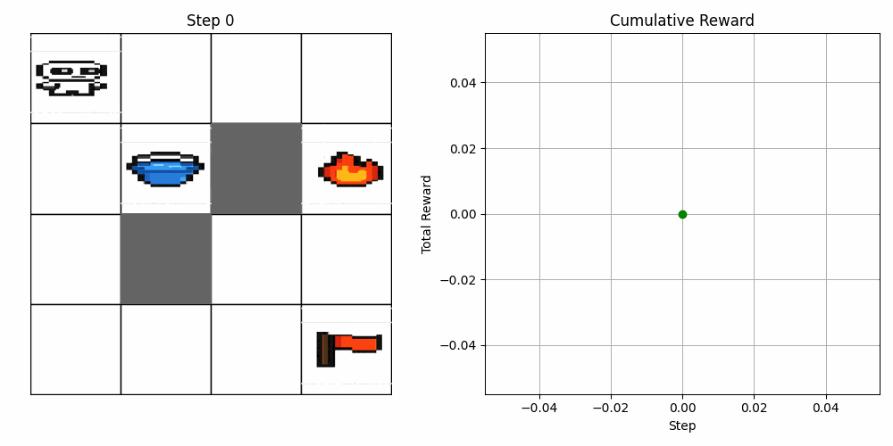
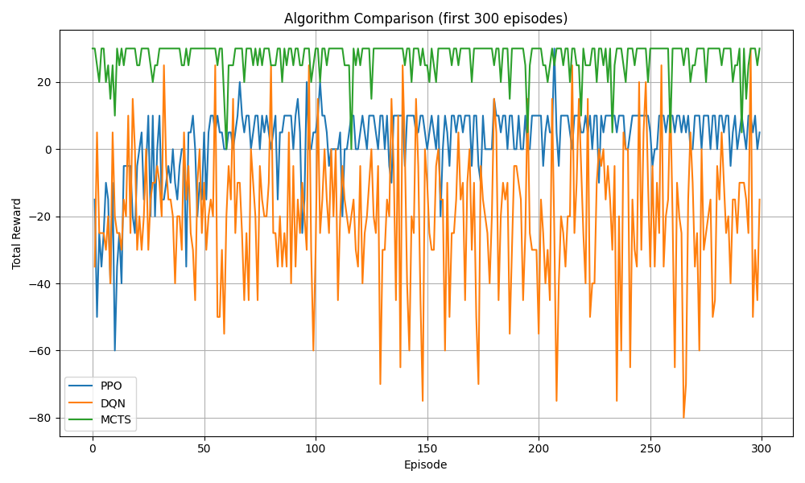

# 🚒 Firefighter GridWorld RL Environment

A 4x4 grid-based reinforcement learning environment where a robot must:

1. Collect a **water bucket** 💧
2. Extinguish a **fire** 🔥
3. Reach the **goal** 🏁

With support for **stochastic policies**, **sprite-based rendering**, and **performance comparison** across multiple RL algorithms.

---

## 🎮 Environment Highlights

* **Fixed layout** with obstacles and objects
* Rewards:

  * +10 for reaching the goal *after* extinguishing fire
  * Penalties for idle steps and invalid sequences
* **Sprites** and **animated GIFs** rendered using Matplotlib
* Custom `FireFighterEnv` based on Gymnasium API

---

## 🧠 Algorithms Compared

Trained for 5,000 steps (MCTS: 50 episodes):

| Algorithm | Mean Reward | Std Dev | Max | Min |
| --------- | ----------- | ------- | --- | --- |
| MCTS      | **27.40**   | 3.64    | 30  | 0   |
| PPO       | 4.00        | 5.83    | —   | —   |
| DQN       | –30.00      | 23.87   | —   | —   |

---

## 🖼 Sample Output

### 🎥 Best Policy Animation (MCTS)



### 📊 Algorithm Comparison



---

## 🔧 Installation

```bash
conda create -n mujocoenv python=3.10
conda activate mujocoenv
pip install -r requirements.txt
```

---

## 🚀 Training

```bash
PYTHONPATH=. python3 agents/train_ppo.py
PYTHONPATH=. python3 agents/train_dqn.py
PYTHONPATH=. python3 agents/train_mcts.py
```

## 📊 Visual Comparison

```bash
PYTHONPATH=. python3 agents/compare_results.py
```

## 🎥 Evaluate Best Policy

```bash
PYTHONPATH=. python3 evaluation/evaluate_mcts.py
```

---

## 📁 Folder Structure

```
firefighter_gridworld/
├── agents/           # Training and analysis scripts
├── env/              # Custom Gym environment and sprite renderer
├── evaluation/       # Evaluate best policy
├── assets/           # Sprites and saved GIF
├── models/           # Saved model checkpoints
├── results/          # Reward plots and comparison graphs
```

---

## 🤝 Acknowledgements

* Developed using [Gymnasium](https://gymnasium.farama.org/)
* RL agents trained with [Stable Baselines3](https://stable-baselines3.readthedocs.io/)

---

## 📌 Future Work

* HuggingFace leaderboard support
* Curriculum learning
* Dynamic fire locations

---

## 📜 License

MIT License. Feel free to fork and contribute.

---

**Author:** Dr. Punit Gupta
